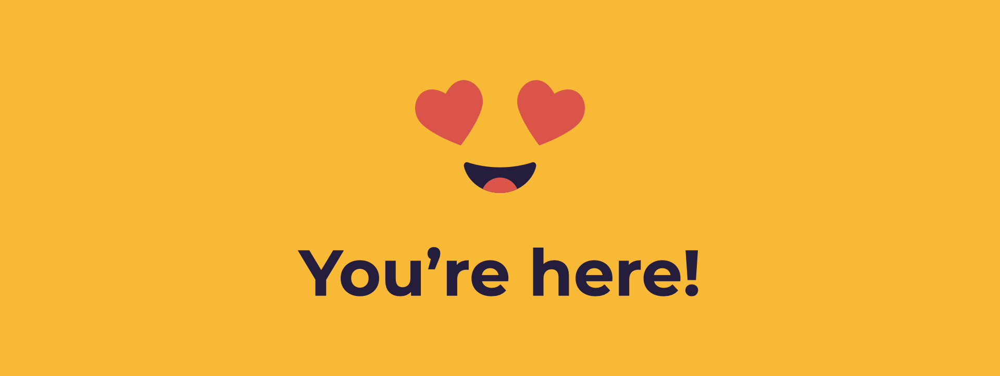

# \#osoc21

## Join us on Discord, and get to know everyone ❤

For this remote edition, we hang out in Discord. Come say hi, we'd love to welcome you!



## Use this Wiki to navigate \#osoc21

* Get an overview of all the [**projects**](projects-1/projects.md)\*\*\*\*
* Find out which tools we use to [**Collaborate & Document**](collaboration-and-documentation.md).

## Got Lost, have Questions?

* **Team Questions** – head over to [**projects**](projects-1/projects.md) and see what the name of your team is, where they hang out in Discord and ask your coach what's up! 
* Design, development, mapping, or other specific questions, go to the **H E L P** section in Discord & ask your question in one of the respective channels!
  * **`#design`**, **`#development`**, **`#mapping`**, ... 
  * For specific design questions, contact Niels on Discord **`Niels#0264`**
  * For technical support, read this [**technical support overview**](https://github.com/osoc21/technical-support) by Jonathan! 
* **Coaching questions**, go to the **`#coaches-councillors`** channel on Discord or contact Miet on Discord **`Miet#7556`**. 
* **Organisational questions**, contact Astrid on Discord **`Astrid#2809`**, or mail [**info@osoc.be**](mailto:info@osoc.be)\*\*\*\*


🚧 This wiki is _always_ under construction — if something is missing or wrong, please contact us at info@osoc.be; and we'll make sure to fix it. 🚧


