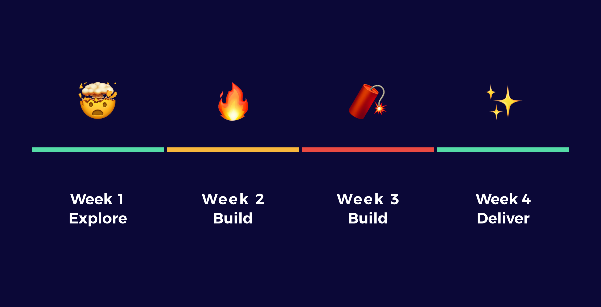

# Calendar for \#osoc21 Belgium

## When

_We do not work on Fridays, weekends or holidays!_

* 1 Month: 5 July — 29 July
* 15 Days: Monday — **Thursday**
  * _21 July is a national holiday_
* Hours: 8 hours per day
  * We start with our morning presentations at 09:00; organise together with your team how you'll make the calendar work!

Add our calendar: [**https://calendar.google.com/calendar/u/1?cid=bWlldGNsYWVzLmNvbV9oMXJzMzFhNzk4MDlyNzQyZTVscGRwZWdiZ0Bncm91cC5jYWxlbmRhci5nb29nbGUuY29t**](https://calendar.google.com/calendar/u/1?cid=bWlldGNsYWVzLmNvbV9oMXJzMzFhNzk4MDlyNzQyZTVscGRwZWdiZ0Bncm91cC5jYWxlbmRhci5nb29nbGUuY29t)\*\*\*\*

{% embed url="https://calendar.google.com/calendar/embed?src=mietclaes.com\_h1rs31a79809r742e5lpdpegbg%40group.calendar.google.com&ctz=Europe%2FBrussels" %}

## Week per week

We are ambitious, but we have systems and a solid structure in place to make sure we reach our goals. The main principle is we **explore for one week, build and test for two weeks** and **prepare for the delivery in the last week**.

* [**Week 1**](week-1-explore.md): Explore
* \*\*\*\*[**Week 2**](week-2-build-and-test.md): Build & Test
* \*\*\*\*[**Week 3**](week-3-build-and-test.md): Build & Test
* \*\*\*\*[**Week 4**](week-4-document-and-deliver.md): Document & Deliver

