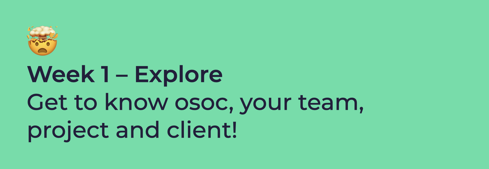

# Week 1: Explore

The goal of this week is to gather as much information you can; about your team members, project, the way you will work together, and what osoc is about. Let's roll!

## Day 1: Welcome \(to the Madness 😏\)

### **09:00 \[all teams\] Introduction**

Welcome to open summer of code! You'll get an introduction about what osoc is about, what [**Open Knowledge Belgium**](https://openknowledge.be/) is, how we work \([**code of conduct**](https://help.osoc.be/global/code-of-conduct) & [**how we work**](https://help.osoc.be/global/way-of-work)\), what our 4 weeks will be about and what you'll be ✨[**delivering**](https://help.osoc.be/global/how-to-deliver-like-a-pro) ✨.

### **10:00 \[team only breakout\] Get to know your team & your project**

### Who’s who & what do you do?

* Icebreaker; get to know each other!
* Share your skills, talents hobbies, …
* Tell us what you can help other people with!

### What are we going to do?

* Study the briefing – You can find the briefing in your [**project site**](../projects-partners/projects-partners-overview.md)!
* Define the goal
* Summarise project \(± 200 characters\) and send it over.
* Compose list of questions for partner/client
  * You can compose it together in the folder of your team under _meeting minutes_

### 12:00 Lunch 😍

### **13:00 \[team only breakout\] Team & Pitch Prep**

Prepare to introduce yourselves to the other teams!

* Think of a **team name** that reflects your members and project and send it over.
* Create a **crest** together \[[Find out how](https://help.osoc.be/global/how-to-create-crests)\]
  * Share the crest in the _crests_ folder, name it after your project and team name, like so: _team-name-crest_
* Send over **a picture** of each team member \(take a selfie with students and coaches\)
  * Add it in the team picture folder. Ask your coach to find that folder.
    * Create a team folder for your team _team-name_
    * Name each picture _team-name-member-name-picture_, and if it's a group pic _team-name-team-picture_
  * Make sure you wear your osoc shirt, and if you don't have it \(yet\), grab a colourful one 🌈

**Create short pitch \(to introduce the team and project, no slides needed\).** You can base yourself on the project description you made. Decide who pitches.

* Team introduction \(coaches and students\)
* Client introduction
* Pitch the project goal

### **15:30 \[all teams\] Live stream team presentations**

Enjoy watching the other teams!

### 17:00 have a nice day 🥳

## Day 2

_Coming soon_

## Day 3

_Coming soon_

## Day 4

_Coming soon_

