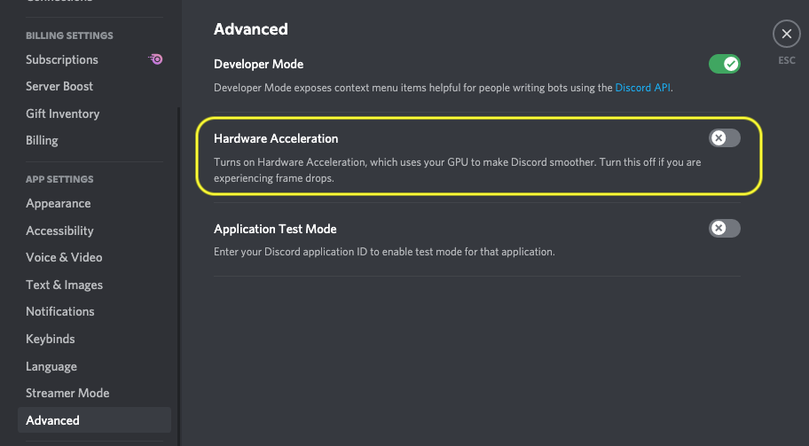
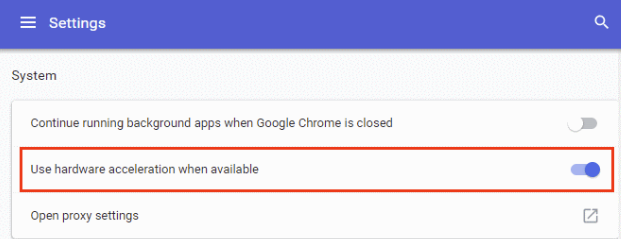

# Moderating Wonder Circles

## Wonder Room

[**https://bit.ly/osoc21**](https://bit.ly/osoc21)



## Your Room Name in Wonder

Make sure that you include the room name of Wonder in your Pitch. Some have been altered because they were too long!



## TDLR \(yes, too didn't long read\); Todo's

### Day before

* [**Divide**](moderating-wonder-circles.md#get-ready-as-a-team-and-divide-work) the work
* [**Have slides ready**](moderating-wonder-circles.md#set-the-stage) to welcome people and to share contact details.
  * Have those contact details by hand to paste them as well!

### During

* [**Politely ask people turn off their mic**](moderating-wonder-circles.md#pick-a-noise-moderator), unless they want to ask a question.
* There can only be 15 people in the room at the same time. Encourage people to move on to other rooms if you've shown your demo and shared your contact details.
* [**Welcome**](moderating-wonder-circles.md#pick-a-master-of-ceremony-to-welcome-people) people \(and use the slides\)
* [**Show off**](moderating-wonder-circles.md#pick-who-will-show-the-demo-a-website) what you've made
* [**Moderate**](moderating-wonder-circles.md#pick-a-question-moderator) questions
* Share your contact details when needed \(paste or show the slides\)

## Get Ready as a Team & Divide work

During the breakout sessions, the team is present in the breakout room to welcome visitors, show off their work and answer questions \(just like in a live edition where they'd come to your booth!\).  
  
Make sure the roles are divided, and you know who is present for what at all times. Big teams; take turns to make sure enough people can enter! The limit is set to 15 people per room.

_This is a chance for you to present yourself to future employers, meet like-minded people and to show people what you've made. Use it as an opportunity_ 😊


Moderating can get quite heavy; so you can definitely split up tasks over your team members and coach\(es\)!



Test your mics together ❤️


## Pick a Noise Moderator

Politely ask people to turn off their microphones unless they want to ask questions; to reduce noise.

If everybody starts talking at the same time, _you're gonna have a bad time_. Only the person speaking should have their microphone on, on their turn. Your team members can manage their own microphone.


**Start Off Quiet –** it's easier to do it at the start.  
****Prepare a little text you can copy-paste when needed \(when new people enter the room\), or turn on your own mic to ask!


## Set the Stage

1. Make sure everyone knows what will happen during the breakout session; and what is expected of them. Prepare a slide to welcome everyone, and outline the rules.
   1. If people are shy, you can add example questions to the chat!
2. Share your contact details in the end! Network mode 🔥

### Templates





#### Font for templates



## Pick a Master of Ceremony to Welcome People

Make sure people feel welcome in your temporary home!

* Welcome everyone!
* Motivate visitors to ask questions in the chat
  * Ask visitors to come on screen with the team and turn on their mic while answering the question.
* Add suggestions, invite team members to show a demo, share websites, ...

## Pick Who Will Show the Demo, a Website, ...?

Multiple people can take on this role, but the most important part is that you made good agreements about it.

## Pick a Question Moderator

The Master of Ceremony might need some backup while answering questions, especially if there's a lot of people in there.

### Keep an eye on questions

A lot of questions coming in? Help out the host.

* Pick interesting and bundle similar questions
* Give the hosts a heads up on:
  * which question is going to be answered
  * who posed the question \(and thus who to invite to the screen with mic\)
  * who will answer the question \(the team member that can answer; this is especially useful in bigger teams\)

#### How to delegate

Pick how, just make sure your team knows in advance!

1. Use the DM function in Wonder
2. Or use discord


Good luck and remember to have fun 🤩


## Optimising the Experience of Wonder

### Making it Nice for Others

* **Turn off your camera, ask people to do the same.** Only turn it on when you are speaking. This will reduce browser overload. _Want to add that human touch to your breakout room? Add a nice pic of your team in the intro of your presentation._ 
* **Make sure just 1 person shares their screen.** Avoid switching between people sharing screens; this causes issues when there's a lot of switching. 
* **Do not tinker with locking circles.** We want conversations to remain open, anyone can drop in \(up until 15 people\).

### Making it Nice for You

If your computer is struggling...

* **Turn off all programs and tabs in your browser that are not needed.** Wonder takes up a lot of space.
* **Disconnect external screens.** They take up a lot of space as well.
* **Discord takes up a lot of computer power.**
  * **Go to settings &gt; advanced in Discord and turn \***_**off\***_ **Hardware Acceleration.**
  * Still struggling? **Consider using your phone for Discord** and turn it off on your computer.

* **Turn \***_**on\***_ **hardware acceleration for your browser.** This will help Wonder perform better.

