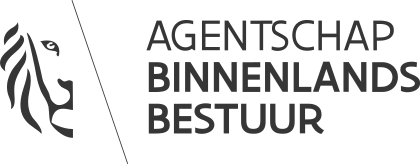

# ABB – MOW – AWV

## Project



_Your partner will give you a nice introduction as well on the first partner meeting!_

### Resources

* About ABB [**https://abb-vlaanderen.gitbook.io/abb/v/english/**](https://abb-vlaanderen.gitbook.io/abb/v/english/)\*\*\*\*
* Linked Data & SPARQL [**https://abb-vlaanderen.gitbook.io/abb/v/english/development/architecture/linked-data**](https://abb-vlaanderen.gitbook.io/abb/v/english/development/architecture/linked-data)\*\*\*\*
* How to use Docker [**https://abb-vlaanderen.gitbook.io/abb/v/english/development/architecture/docker**](https://abb-vlaanderen.gitbook.io/abb/v/english/development/architecture/docker)\*\*\*\*
* Using ember.js [**https://abb-vlaanderen.gitbook.io/abb/v/english/development/architecture/ember.js**](https://abb-vlaanderen.gitbook.io/abb/v/english/development/architecture/ember.js)\*\*\*\*
* Style components [**https://abb-vlaanderen.gitbook.io/abb/v/english/development/front-end/css**](https://abb-vlaanderen.gitbook.io/abb/v/english/development/front-end/css)\*\*\*\*

### GitHub

* Team: [https://github.com/orgs/osoc21/teams/the-floof-fighters](https://github.com/orgs/osoc21/teams/the-floof-fighters)
* Repository: [https://github.com/osoc21/RoadBase](https://github.com/osoc21/RoadBase)

### **Discord Channel**

\#safe-open-roads

## File storage

_For collaboration & storing files._ [**https://drive.google.com/drive/folders/1tOHAE9ACMc2i2MZcimfIaQTnfaGAadeU?usp=sharing**](https://drive.google.com/drive/folders/1tOHAE9ACMc2i2MZcimfIaQTnfaGAadeU?usp=sharing)\*\*\*\*

## Team

### Coaches

#### Lead


**Coach Jodi \[Jodi De Loof\#6665 on Discord\]  
MOW/ABB/AWV, Arvesta**  
  
[**https://github.com/jodiDL**](https://github.com/jodiDL)  
  
****To be completed!


#### Support


**Coach Inti \[Valderas\#1429 on Discord\]  
Mobile Ratchetticker / Mobiele Rateltikker, MOW/ABB/AWV**  
UX-Designer at Smooth Sailing  
  
**Bio**  
Being addicted to Minecraft as a kid showed me the value of user experience when I was setting op server and creating communities. With that I started my study in Interaction Design and started eventually started working at Smooth Sailing as a User Experience Designer.  
  
__**Skills**  
__UI Design, UX, Accessibility, Motion  
Figma, Notion, Adobe create cloud apps  
[**valderas.be**](http://valderas.be)  
****[**github.com/IntiValderas**](https://github.com/IntiValderas)  
****[**smoothsailing.be**](http://smoothsailing.be)  
  
**Good to know**  
_Inti is the name of the Inca sun god_


### Students

Sam, Fien, Inés, Bo, Sybren, Hans, Xuan Hung, Lieselot, Ilya

### Specific councillors

Aad \(madnificent\) from Redpencil – will join us!

## Logo's

