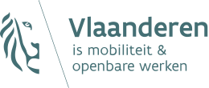

# ABB – MOW – AWV

## Project

Find the description of your project here: [https://cloud.openknowledge.be/s/inBKkGwAqiNe5Wa](https://cloud.openknowledge.be/s/inBKkGwAqiNe5Wa)

_Your partner will give you a nice introduction as well on the first partner meeting!_

### Resources

* About ABB [https://abb-vlaanderen.gitbook.io/abb/v/english/](https://abb-vlaanderen.gitbook.io/abb/v/english/)
* Linked Data & SPARQL [https://abb-vlaanderen.gitbook.io/abb/v/english/development/architecture/linked-data](https://abb-vlaanderen.gitbook.io/abb/v/english/development/architecture/linked-data)
* How to use Docker [https://abb-vlaanderen.gitbook.io/abb/v/english/development/architecture/docker](https://abb-vlaanderen.gitbook.io/abb/v/english/development/architecture/docker)
* Using ember.js [https://abb-vlaanderen.gitbook.io/abb/v/english/development/architecture/ember.js](https://abb-vlaanderen.gitbook.io/abb/v/english/development/architecture/ember.js)
* Style components [https://abb-vlaanderen.gitbook.io/abb/v/english/development/front-end/css](https://abb-vlaanderen.gitbook.io/abb/v/english/development/front-end/css)

### Repository

_In progress_

## File storage

_For collaboration & storing files._ [**https://drive.google.com/drive/folders/1tOHAE9ACMc2i2MZcimfIaQTnfaGAadeU?usp=sharing**](https://drive.google.com/drive/folders/1tOHAE9ACMc2i2MZcimfIaQTnfaGAadeU?usp=sharing)\*\*\*\*

## Coaches

## Team

## Councillors

## Logo's

