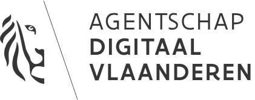

# ADV

## Project

At the start of osoc, you'll be divided in two teams; and you'll be working on these two projects!

**Team 1**



**Team 2**



### Repository

_Soon._

### **Discord Channel**

\#adv-ldes

## File storage

_For collaboration & storing files._  
[**https://drive.google.com/drive/folders/1D-I5DlVeH8CEXhkOAnvQ9cM1qaQAXlj-?usp=sharing**](https://drive.google.com/drive/folders/1D-I5DlVeH8CEXhkOAnvQ9cM1qaQAXlj-?usp=sharing)\*\*\*\*

## Team

### Coaches

#### Lead


**Coach Demian \[demian\#0216 on Discord\]  
ADV, IDLab**  
Software Engineer at Skedify  
  
**Bio**  
My name is Demian Dekoninck. I work at Skedify as a Full Stack Software Engineer where I \(most of the time\) work with Node.js and React.  
  
__**Skills**  
__Back-end, Front-end  
Node.js, JavaScript, TypeScript, PHP, Laravel, AWS, Terraform, Serverless, DynamoDB, Docker, Kubernetes, Microservices, GraphQL, GitHub, GitHub Actions, TailwindCSS, React.js, Next.js  
[**https://dem.be**](https://dem.be)  
****[**https://github.com/DemianD**](https://github.com/DemianD)  
  
**Good to know**  
_Random fact: I love pizza Hawaii_ 🍕


#### Support


**Coach Martin \[vanakenm\#3648** **on Discord\]  
ADV, IDLab**  
Freelancer at Joyous Coding  
  
**Bio**  
I'm Martin. I've been developing software & helping other develop software for the last 20 years in companies big and small, but mostly startups. I like to build & ship stuff with nice people  
  
__**Skills**  
__Maps, Tech lead, Coach  
Python, JavaScript, React, Ruby, Django, Rails, Unit Test, Web Development  
[**joyouscoding.com**](http://joyouscoding.com)  
****[**http://github.com/vanakenm**](http://github.com/vanakenm)  
  
**Good to know**  
_I'm 43_



**Coach Xavier \[Ξavier\#1866 on Discord\]  
ADV, IDLab**  
Head of Product & Design at Mono  
  
**Bio**  
As the co-founder and managing partner of Mono, I help tech companies ship products that people love. By combining the right product strategy with solid interface design, customers can improve satisfaction ratings, stay ahead of their competitors and build products that have the right kind of impact. I have worked with companies in Belgium, throughout Europe, in China and the U.S.A.

Through my work, I hope to make our interactions with technology more meaningful. I’ve worked on tech products in the healthcare, big data, and proptech industries, as well as for governments.  
  
__**Skills**  
__UI Design, Coaching & Design Career Development, Product Management, UX Research, Front-end  
Design Career Journeys, Mental Models, My Brain, Roam Research, Notion, Figma, Sketch, HTML, CSS, JS  
[**https://xavierbertels.com**](https://xavierbertels.com)  
****[**https://github.com/xavez**](https://github.com/xavez)  
****[**https://mono.company**](https://mono.company)  
  
**Good to know**  
_Talk to me about martial arts, music, tea or random facts from Wikipedia!_


### Students

Clément, Arno T, Wout, Ryan, Carlos

### Specific councillors


**Councillor Pieter C \[pietercolpaert\#8772 on Discord\]  
ADV**  
Semantic Web researcher at IDLab \(imec-ugent\)  
  
**Bio**  
Pieter is a Linked Open Data researcher at Ghent University IDLab working on Linked Data Event Streams. He also co-founded Open Knowledge Belgium and started open summer of code together with Miet when they were still young.  
  
__**Skills**  
__Back-end c, k, m  
JavaScript, [**https://github.com/Comunica**](https://github.com/Comunica), [**https://github.com/rdfjs**](https://github.com/rdfjs)  
[**https://pietercolpaert.be**](https://pietercolpaert.be)  
****[**https://github.com/pietercolpaert**](https://github.com/pietercolpaert)  
****[**https://tree.linkeddatafragments.org**](https://tree.linkeddatafragments.org)  
  
**Good to know**  
_I use emacs and I’m too old to change now._



**Councillor Brecht \[Brecht\#1060 on Discord\]  
ADV**  
Semantic Web researcher at IDLab \(imec-ugent\)  
  
**Bio**  
Hi! If you have a question relating to Linked Open Data, let me know!  
  
__**Skills**  
__Back-end data modelling/mapping/publishing, Web APIs, Linked Data  
Javascript \(node.js\)  
[**https://knows.idlab.ugent.be/**](https://knows.idlab.ugent.be/)  
****[**https://github.com/brechtvdv**](https://github.com/brechtvdv)  
  
**Good to know**  
_In my spare time I'm working in my "mini farm". My wife and I are keeping bees, sheep and chickens and hope to share this authentic way of living with others._  
****[**https://twitter.com/brechtvdv**](https://twitter.com/brechtvdv)\*\*\*\*



**Councillor Dwight \[ddvlanck\#5582 on Discord\]  
ADV**  
Information Architect at Digital Flanders  
  
**Bio**  
/  
  
__**Skills**  
__Back-end  
****[**https://github.com/ddvlanck**](https://github.com/ddvlanck)  
  
**Good to know  
/**


## Logo

