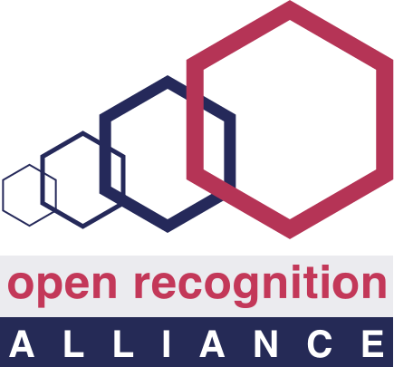
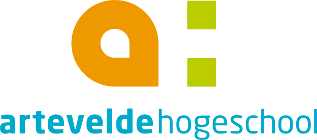
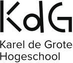
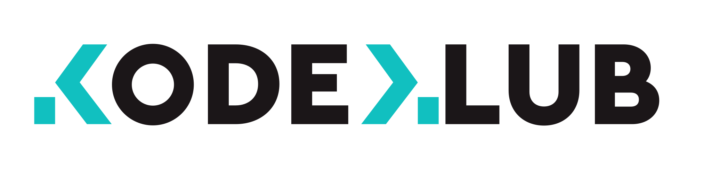

# Consortium: Open Recognition Alliance, Artevelde Hogeschool, HoGent, KodeKlub, Belnet, KdG

## Project



### Resources

To familiarize yourself with Open Badges, we recommend you read the following:

* Open Badges were first created by the Mozilla Foundation, [on this page](https://support.mozilla.org/en-US/kb/why-open-badges) they explain why. 
* When the Mozilla Foundation created Open Badges, they also wrote [this whitepaper. ](https://wiki.mozilla.org/images/5/59/OpenBadges-Working-Paper_012312.pdf)
* In the Netherlands, SURF used the concept of Open Badges and created Edubadges. Read about their experience and findings [here. ](https://www.surf.nl/whitepaper-open-badges-en-microcredentialing)
* Your coach Emma has experimented with Open Badges at Dutch high schools, read about her experience and vision on Open Badges [here.](https://www.emmastoks.nl/post/de-grote-kans-van-open-badges) 

### GitHub

* Team: [https://github.com/orgs/osoc21/teams/the-fantastic-two](https://github.com/orgs/osoc21/teams/the-fantastic-two)
* Repository: [https://github.com/osoc21/Belbadges](https://github.com/osoc21/Belbadges)

### **Discord Channel**

\#edubadges-belgium

## File storage

_For collaboration & storing files._  
[**https://drive.google.com/drive/folders/1mELCT1ovz\_5SUkVLe-AAU9pbTsgAaWNZ?usp=sharing**](https://drive.google.com/drive/folders/1mELCT1ovz_5SUkVLe-AAU9pbTsgAaWNZ?usp=sharing)\*\*\*\*

## Team

### Coaches

#### Lead


**Coach Emma \[emmastoks\#5746 on Discord\]  
Artevelde Hogeschool & Belnet**  
Chair ****at Open Fields Foundation  
  
**Bio**  
At 17, I chose not to go to college, but instead make the world my university. I created Emma's College and dove deep into the world of innovative learning and development. Today I run the Open Fields Foundation, where we focus on making the world a little more equal by opening up information, sectors and \(academic\) disciplines.  
  
__**Skills**  
__Storytelling, self-directed learning, career development  
[**https://www.openfieldsfoundation.com/**](https://www.openfieldsfoundation.com/)  
****[**https://github.com/emmastoks**](https://github.com/emmastoks)  
  
**Good to know**  
_I cook a great pasta al limone_


#### Support


**Coach Bert \[jeborsel\#6737 on Discord\]  
Artevelde Hogeschool & Belnet**  
Innovation at BOSA  
  
**Bio**  
Limburger, Wereldburger  
\(English: Limburger, World Burger 🍔\)  
  
__**Skills**  
__Business modelling, Badges, Project Mgmt, Gov workings  
Badges Badges Badges, some knowledge of R , Vue, Quasar, Firebase, SQL  
[**https://jeborsel.com/**](https://jeborsel.com/)  
****[**https://github.com/jeborsel**](https://github.com/jeborsel)  
  
**Good to know**  
_I eat ice faster than you can break it_


### Students

Lies, Marie

## Logo's

