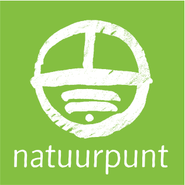

# Natuurpunt

## Project

Find the description of your project here:  
[**https://cloud.openknowledge.be/s/d2pTR9zQknnA4AF**](https://cloud.openknowledge.be/s/d2pTR9zQknnA4AF)\*\*\*\*

### Resources

_In progress._

### Repository

_In progress_

## File storage

_For collaboration & storing files._  
[**https://drive.google.com/drive/folders/1ZgwcUVrjhR59hbMQDXKfs8AvWv1ucH4a?usp=sharing**](https://drive.google.com/drive/folders/1ZgwcUVrjhR59hbMQDXKfs8AvWv1ucH4a?usp=sharing)\*\*\*\*

## Coaches


**Coach Pol \[POLO\#6838 on Discord\]  
Natuurpunt & Oost-Vlaanderen**  
Co-founder at Avalanche Productions  
  
**Bio**  
I identify myself as a digital swiss knife.  
  
__**Skills**  
__Graphic Design, UI, UX, Videography, Storytelling, Marketing, Photography, Sound design, Streaming  
HTML, CSS, Illustrator, Photoshop, Premiere, InDesign, Audition, Lightroom, XD, OBS, Notion  
[**http://avalanche-prod.be**](http://avalanche-prod.be)  
****[**https://github.com/labautpol**](https://github.com/labautpol)\*\*\*\*

**Good to know**  
_I use discord in white mode during the day \(I swear I’m not a psychopath\)_



**Coach Joost \[joostschouppe\#3203 on Discord\]  
Natuurpunt & Oost-Vlaanderen**  
Data manager at provincies.incijfers.be  
  
**Bio**  
I like maps.  
Especially open maps!  
I like data.  
Especially open data!  
I like to dabble in programming.  
Especially open source!  
I'm a data analyst and a geospatial nerd, not a programmer  
  
__**Skills**  
__Maps data modeling, data analytics, geospatial statistics  
HTML, SPSS, QGIS, MapComplete  
[**https://github.com/joostschouppe/**](https://github.com/joostschouppe/)\*\*\*\*

**Good to know**  
_I will make detours to be able to improve OpenStreetMap._  
[**https://www.openstreetmap.org/user/joost%20schouppe/**](https://www.openstreetmap.org/user/joost%20schouppe/)\*\*\*\*


## Team

_In progress_

## Councillors

## Logo

